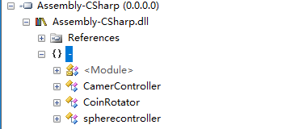

&emsp;保存和备份很重要，所以随手保存和存有备份要成为我的习惯。使用Hexo在github搭建的博客，仓库里只有生成的静态网页文件，是没有Hexo的源文件的，如果现在这个电脑出现了什么问题，那就麻烦了。备份的教程和搭建的教程比起来简直是少的可怜，好不容易找到一份教程，使用`npm install hexo-git-backup --save`备份插件，却是安装不上，所以果断放弃，就在我准备自己再设一个repository用来放markdown文件时，看到了一份简单明了的教程，所以我需要把过程记录下来，以后忘了还可以有个参考

